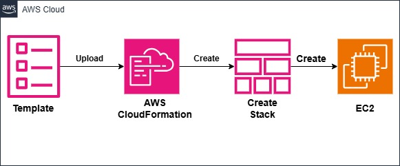

#  EC2 Instance Automation with AWS CloudFormation

This project demonstrates how to **automatically launch an EC2 instance** using an **AWS CloudFormation YAML template**.  
It’s a simple example of **Infrastructure as Code (IaC)** — no manual clicks, just automation 💻⚡

---

## 📘 Project Steps

**Step 1:** Create a file named `ec2-template.yaml`  
**Step 2:** Define EC2 instance and Security Group inside it  
**Step 3:** Go to AWS Console → CloudFormation → Create Stack  
**Step 4:** Upload the YAML file and deploy the stack  
**Step 5:** CloudFormation will automatically create an EC2 instance 🎯  
**Step 6:** Check “Outputs” tab for Public IP and Instance ID  

---

## 🏗️ Architecture Flow

**Template → CloudFormation → Stack → EC2 Instance**

Here’s a simple diagram showing the flow 👇  

---

## ⚡ CLI vs CloudFormation

| AWS CLI | AWS CloudFormation |
|----------|--------------------|
| Commands are executed manually | Everything is automated |
| No rollback if something fails | Automatic rollback on failure |
| Need to repeat commands every time | Reusable YAML template |
| Hard to manage multiple resources | Easily manages all resources as a stack |

---

## 🧩 Files Included

- `ec2-template.yaml` → CloudFormation template  
- `diagram.png` → Architecture flow image  
- `README.md` → Documentation  

---

## 🏷️ Technologies Used

- AWS CloudFormation  
- EC2  
- YAML  
- Infrastructure as Code (IaC)  

---

⭐ **If you found this helpful, don’t forget to give this repo a star!** 🌟  
Let’s keep learning and automating with AWS 🚀  
THANKYOU

#AWS #CloudFormation #DevOps #Automation #EC2 #CloudComputing #InfrastructureAsCode #AWSLearning #AWSCommunity #TechJourney

